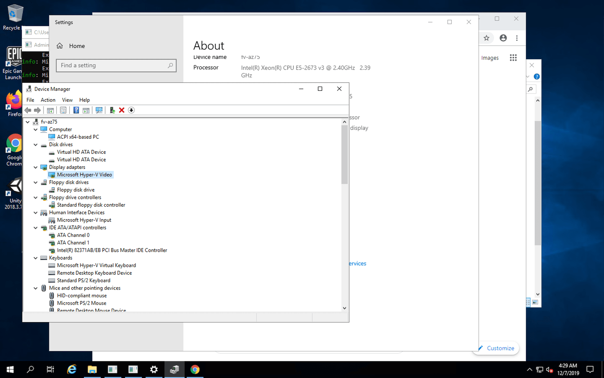

# ENG

# Reverse RDP into Windows on GitHub Actions

Ever wonder what the Desktop of the Windows Runners on GitHub Actions looks like?

This functionality is like Appveyor's RDP functionality for their Windows workers:

https://www.appveyor.com/docs/how-to/rdp-to-build-worker/

## Usage

1. Signup for an [ngrok] account.
2. Get the tunnel auth token at: https://dashboard.ngrok.com/auth .
3. Under the repository's settings, make a secret called `NGROK_AUTH_TOKEN` and set it to the tunnel auth token from ngrok.
4. Trigger a build by clicking on `Actions` section and select `LuppiLandia - RDP`.
5. Run a workflow and then press `build`. [If you don't see any workflow in progress, press F5 or refresh your browser's page to make it appear]
6. Wait until the last step which will hang forever as it connects to ngrok and sets up the reverse tunnel.
7. Note the active public host and port.
8. Connect via host and port through your favorite RDP client. [The host and port will be provided automatically during the process] 
9. Use the username `Administrator` and the password. [The password will be generated by the activation of the VPS and it'll be show in the process]
10. Enjoy! ☕

## Useful Info

* Runners can run sessions for up to 6 hours. So you have about 6 hours minus the minute setup time to poke around in these runners.
* If using for introspection, add the [`continue-on-error`](https://help.github.com/en/actions/automating-your-workflow-with-github-actions/workflow-syntax-for-github-actions) property to the failing step before these remote connection steps.

## License

MIT License

Copyright (c) 2020-2022 LuppiLandia

Permission is hereby granted, free of charge, to any person obtaining a copy
of this software and associated documentation files (the "Software"), to deal
in the Software without restriction, including without limitation the rights
to use, copy, modify, merge, publish, distribute, sublicense, and/or sell
copies of the Software, and to permit persons to whom the Software is
furnished to do so, subject to the following conditions:

The above copyright notice and this permission notice shall be included in all
copies or substantial portions of the Software.

THE SOFTWARE IS PROVIDED "AS IS", WITHOUT WARRANTY OF ANY KIND, EXPRESS OR
IMPLIED, INCLUDING BUT NOT LIMITED TO THE WARRANTIES OF MERCHANTABILITY,
FITNESS FOR A PARTICULAR PURPOSE AND NONINFRINGEMENT. IN NO EVENT SHALL THE
AUTHORS OR COPYRIGHT HOLDERS BE LIABLE FOR ANY CLAIM, DAMAGES OR OTHER
LIABILITY, WHETHER IN AN ACTION OF CONTRACT, TORT OR OTHERWISE, ARISING FROM,
OUT OF OR IN CONNECTION WITH THE SOFTWARE OR THE USE OR OTHER DEALINGS IN THE
SOFTWARE.

[ngrok]: https://ngrok.com/

------------------

# ITA

# Reverse RDP nei VPS Windows tramite GitHub Actions

Ti sei mai chiesto come appare il desktop dei Windows Runner su GitHub Actions?

Questa funzionalità è come la funzionalità RDP di Appveyor per i propri lavoratori Windows: 

https://www.appveyor.com/docs/how-to/rdp-to-build-worker/

## Utilizzo

1. Registra un account [ngrok]. 
2. Ottieni il token di autenticazione su: https://dashboard.ngrok.com/auth .
3. Nelle impostazioni del repository, crea un segreto chiamato `NGROK_AUTH_TOKEN` e impostalo sul token di autenticazione del tunnel da ngrok.
4. Attiva una build facendo clic sulla sezione `Azioni` e seleziona `LuppiLandia - RDP` 
6. Eseguire un worklow e premere successivamente `build`. [Se non vedi alcun workflow in corso, premi F5 o aggiorna la pagina del browser per farlo apparire]
7. Attendi fino all'ultimo passaggio mentre si connette a ngrok.
8. Prendere nota dell'host pubblico e della porta.
9. Connettiti tramite host e porta attraverso il tuo client RDP preferito. [L'host e la porta verranno forniti in modo automatico durante il processo]
10. Utilizzare il nome utente `Administrator` e la password. [La password verrà generata dall'attivazione del VPS e verrà mostrata durante il processo] 
11. Divertiti! ☕

## Informazioni utili

* Le sessioni possono arrivare ad un massimo di 6 ore. Quindi hai circa 6 ore meno i minuti di setup per curiosare tra queste VPS.
* Se si utilizza per l'introspezione, aggiungere [`continue-on-error`](https://help.github.com/en/actions/automating-your-workflow-with-github-actions/workflow-syntax-for- github-actions) al passaggio non riuscito prima di questi passaggi di connessione remota. 

## Licenza

Licenza MIT

Copyright (C) 2020-2022 LuppiLandia

L'autorizzazione è concessa, a titolo gratuito, a chiunque ne ottenga una copia
di questo software e dei file di documentazione associati (il "Software"), per trattare
nel Software senza restrizioni, inclusi senza limitazione i diritti di
utilizzare, copiare, modificare, unire, pubblicare, distribuire, concedere in sublicenza e/o vendere
copie del Software e per consentire alle persone a cui il Software è
arredato a tal fine, alle seguenti condizioni:

L'avviso di copyright di cui sopra a questo avviso di autorizzazione devono essere inclusi in tutte
le copie o parti sostanziali del Software.

IL SOFTWARE VIENE FORNITO "COSì COM'È", SENZA GARANZIE DI ALCUN TIPO, ESPRESSE O
IMPLICITA, COMPRESE MA NON LIMITATE ALLE GARANZIE DI COMMERCIABILITÀ,
IDONEITÀ A UNO SCOPO PARTICOLARE E NON VIOLAZIONE. IN NESSUN CASO GLI AUTORI O I TITOLARI DEL COPYRIGHT SARANNO RESPONSABILI PER QUALSIASI RECLAMO, DANNI O ALTRA
RESPONSABILITÀ, SIA IN AZIONE CONTRATTUALE, ILLECITO O ALTRO, DERIVANTE DA FUORI O IN CONNESSIONE CON IL SOFTWARE O L'USO O ALTRI TRATTAMENTI IN
SOFTWARE. 

[ngrok]: https://ngrok.com/

------

## ALL RIGHTS RESERVED / TUTTI I DIRITTI RISERVATI

* DO NOT SHARE THIS WITH ANYONE

* NON CONDIVIDERE QUESTO CON NESSUNO

